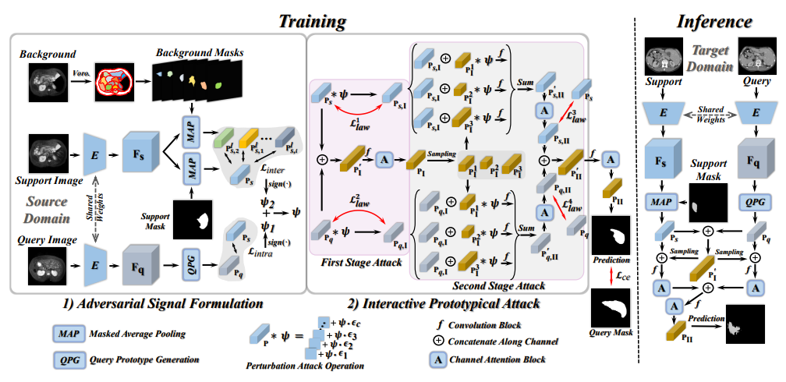
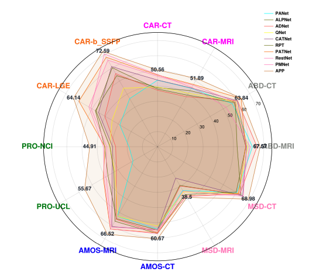

# APP: Adversarial Prototypical Perturbation for Cross-domain Few-shot Medical Image Segmentation  

#### Abstract
Few-shot Medical Image Segmentation (FSMIS) has become one of the potential solutions for limited annotated data learning. However, the realistic multiple domains of medical data demands the FSMIS models generalizing across domains. To this end, we introduce the new task of cross-domain few-shot medical image segmentation (CD-FSMIS) and propose the Adversarial Prototypical Perturbation (APP) method which employs the adversarial learning strategy in the prototype learning process for gaining the domain robust prototypes. Specifically, the method consists of two components: Adversarial Signal Formulation (ASF) and Interactive Prototypical Attack (IPA). The ASF module collects perturbations from the gained gradients from both of the intra-class variation measurement loss and the inter-class variation measurement loss, and the IPA module aims to impose gained perturbations on the prototypical representation construction process with the two stages of interactive attacking manner. Additionally, a local-imbalance aware whitening loss is designed to resist the shift sensitive local components for further enforcing to learn the domain robust prototypical representation in the IPA module. Extensive experiments are conducted on three cross-domain medical imaging datasets, and the results demonstrate that our model outperforms the state-of-the-art few-shot medical image segmentation methods.

#### Installation 

#### Data Preparation

#### Run

#### Performance 

      

#### Checkpoints

